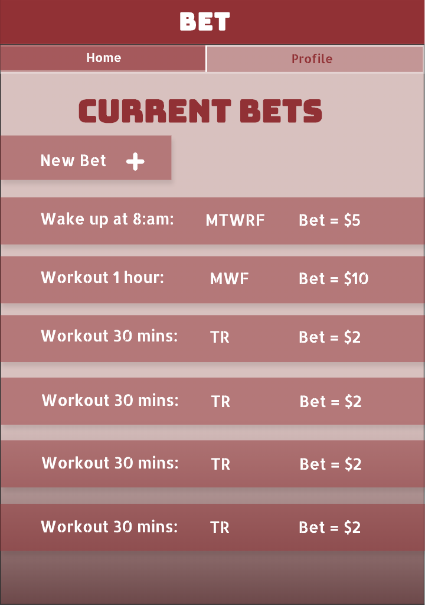
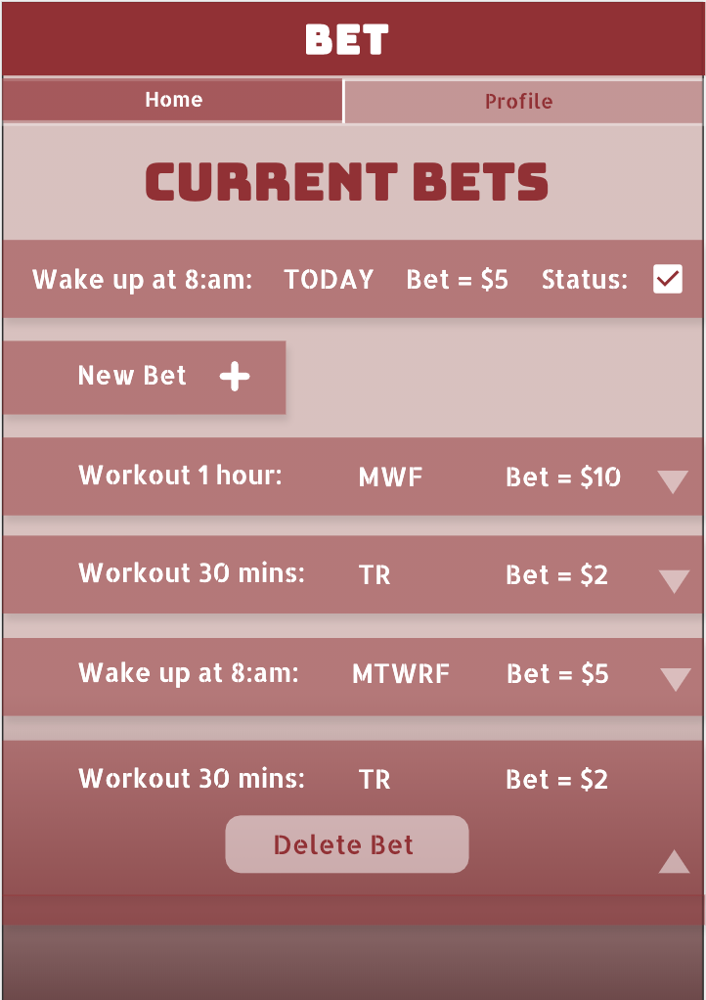
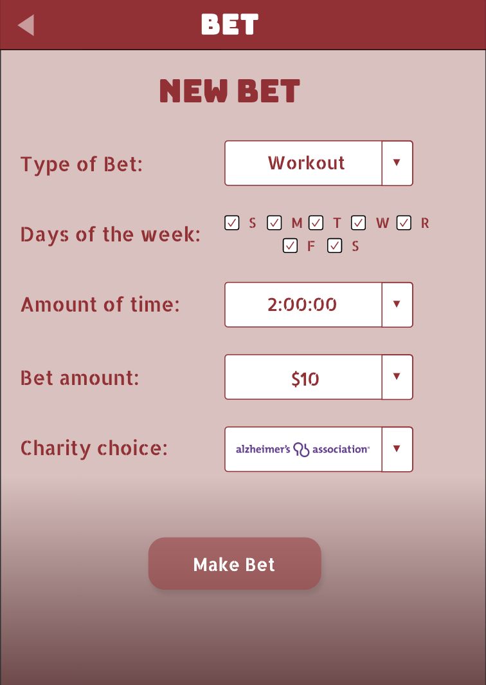
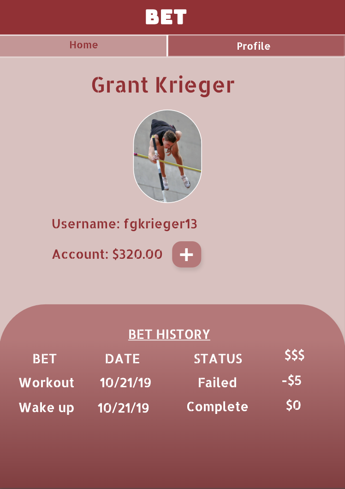

# Bet App: A Web Application that allows people to become more accountable in daily tasks through habit forming psychology.
Bet App lets someone select a time in the morning they plan to wake up or an amount of time to workout and assign the selected time to certain days of the week. They then make a bet against the application of whether they will accomplish the task that day. If they successfully wake up in time or workout they will win the bet but if they do not then the app will win the bet and take the bet amount from their account and send it to a charity of choice.


## Prerequisites
In order to run this project, the following software needed to be installed:
- [Node.js](https://nodejs.org/en/)
- [PostrgeSQL](https://www.postgresql.org/)
- [Nodemon](https://nodemon.io/)

## Create the database and tables in SQL
I created a new database called `bet_app` and created `user`, `bets` & `completion` tables:

```SQL
CREATE TABLE "user" (
    "id" SERIAL PRIMARY KEY,
    "username" VARCHAR (80) UNIQUE NOT NULL,
    "password" VARCHAR (1000) NOT NULL,
    "first_name" VARCHAR (1000) NOT NULL,
    "last_name" VARCHAR (1000) NOT NULL,
    "amount_cash" INT
);

CREATE TABLE "bets" (
    "id" SERIAL PRIMARY KEY,
    "bet_type_id" INT REFERENCES "bet_type",
    "bet_amount" VARCHAR (1000) NOT NULL,
    "time_select" INT,
    "time_amount" INT,
    "charity_id" INT REFERENCES "charity",
    "sunday" BOOLEAN,
    "monday" BOOLEAN,
    "tuesday" BOOLEAN,
    "wednesday" BOOLEAN,
    "thursday" BOOLEAN,
    "friday" BOOLEAN,
    "saturday" BOOLEAN,
    "user_id" INT REFERENCES "user"
);

     CREATE TABLE "completion" (
    "id" SERIAL PRIMARY KEY,
    "bets_id" INT REFERENCES "bets",
    "status" BOOLEAN,
    "time" TIMESTAMP
);
```

## Built With
- React.js
- Redux
- Express
- PostgreSQL
- Passport
- CSS
- Cron
- Material-Icons  

## Screen Shot Examples
# Main Page


# Bet when clicked


# New Bet Form


# Profile


## Authors
- Grant Krieger

## License
----- -----

## Acknowledgments
- I would like to thank Kris Szafranski for helping me troubleshoot problems while designing and building this application. I would also like to thank Prime Digital Academy and the support I received from my cohort.


